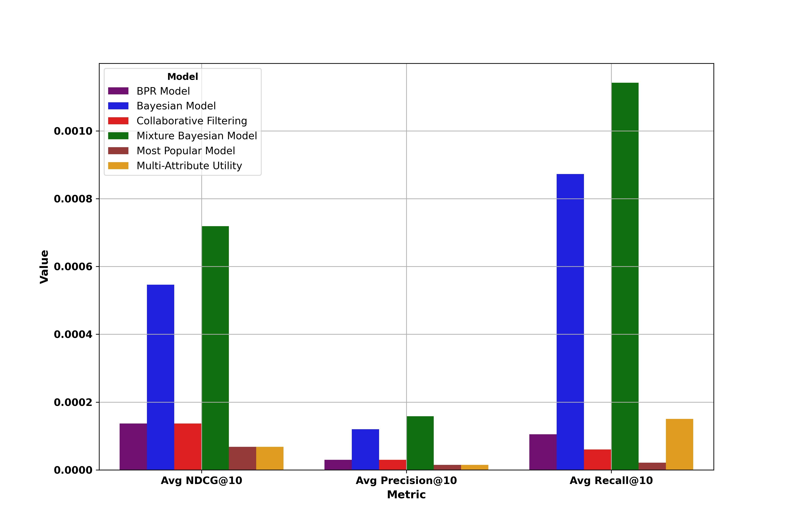
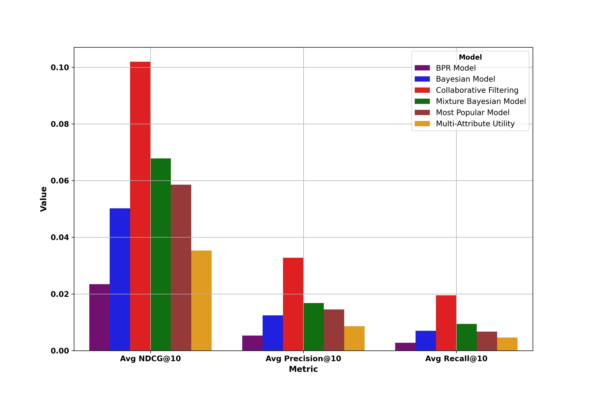
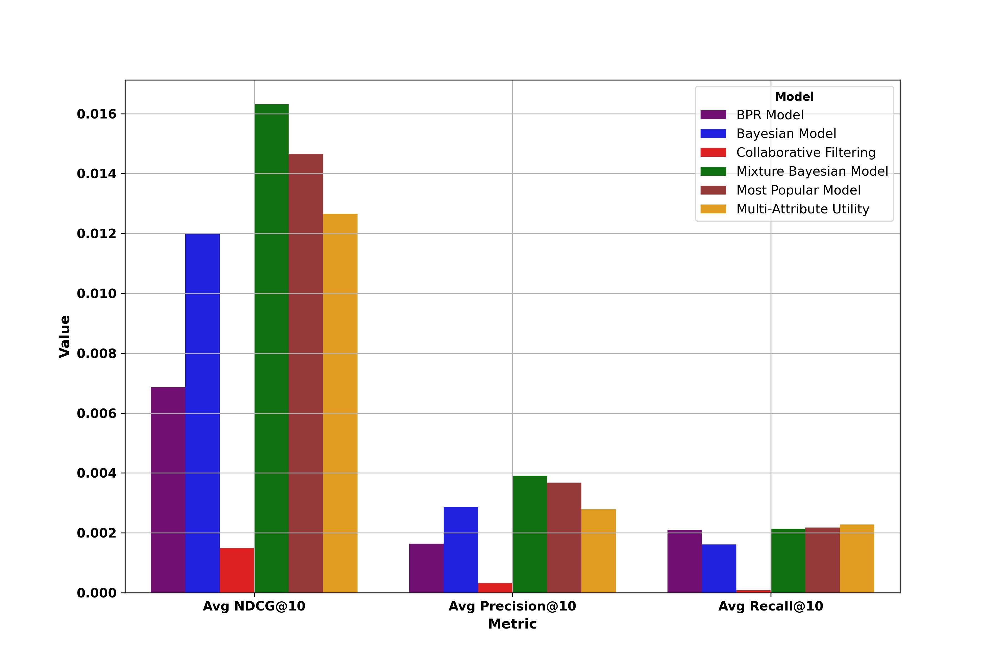

# Bayesian Preference Estimation with Inconsistent Feedback

This website contains access to data, code, and results for the paper "Bayesian Preference Estimation with Inconsistent Feedback," submitted to the journal of Mathematical Psychology.

## Datasets

There are three datasets used in this paper with the following statistics:

| **Dataset**       | **Number of Users** | **Number of Items** | **Number of Interactions** | **Number of Categories** | **% Sparsity** |
|-------------------|---------------------|---------------------|----------------------------|--------------------------|----------------|
| **Yelp**          | 6,651               | 8,267               | 264,174                    | 265                      | 99.55%         |
| **MovieLens1M**   | 6,040               | 3,260               | 998,538                    | 18                       | 94.93%         |
| **MovieLensSmall**| 610                 | 8,974               | 100,010                    | 19                       | 98.17%         |

Sample data snapshot - from MovieLens dataset:

| **UserID** | **movieID** | **Like Status** | **Primary Genre** | **Secondary Genre** |
|--------|---------|-------------|---------------|-----------------|
| 54462  | 288     | 0           | Adventure     | Comedy          |
| 20948  | 247     | 0           | Action        | Adventure       |
| 25386  | 401     | 0           | Action        | Adventure       |
| 48678  | 491     | 1           | Comedy        | Drama           |
| 42717  | 322     | 1           | Crime         | Drama           |
| 52687  | 143     | 0           | Adventure     | Drama           |
| 66403  | 218     | 0           | Action        | Adventure       |
| 41867  | 130     | 1           | Drama         | Thriller        |
| 10548  | 69      | 0           | Action        | Drama           |
| 58166  | 33      | 0           | Action        | Comedy          |

From Yelp Dataset:

| **UserID** | **LocationID** | **Like Status** | **Type of Location**  | **City**          |
|--------|---------|-------------|-------------------|----------------|
| 155    | 442     | 0           | Cinema            | San Francisco  |
| 1734   | 6273    | 1           | Cinema            | New York       |
| 231    | 3004    | 1           | Restaurant        | Los Angeles    |
| 787    | 3475    | 1           | Shopping Center   | San Francisco  |
| 2293   | 1857    | 1           | Cinema            | San Francisco  |
| 1643   | 364     | 0           | Restaurant        | Chicago        |
| 565    | 2669    | 0           | Restaurant        | San Francisco  |
| 5013   | 6758    | 0           | Shopping Center   | Los Angeles    |
| 3500   | 429     | 0           | Shopping Center   | Chicago        |
| 605    | 4223    | 1           | Restaurant        | Los Angeles    |

### Process Data Download Instruction
The raw data for this work can be downloaded from this link sepearated by train, test, category dataset. 
https://drive.google.com/drive/folders/1FJuFtMRYNtdmvzy-gaC1eynusRdsnnoJ?usp=sharing
Three folders are included, each folder contain data for one of the datasets (folders are MovieLens1M, MovieLensSmall, Yelp)
## Models Evaluated

In this research, we evaluate the performance of our proposed model by comparing it against several well-known baseline models. These models include advanced machine learning techniques and established Bayesian methods. Unlike our proposed model, these baselines do not explicitly account for user inconsistency.

### 1. Bayesian Updating Model
This model employs Bayesian inference to update the parameters of a Beta distribution for each user-attribute pair based on binary feedback (e.g., like/dislike). 

### 2. Bayesian Personalized Ranking (BPR)
BPR is designed for optimizing ranking tasks with implicit feedback, such as clicks or purchases, rather than explicit ratings.

### 3. Collaborative Filtering Model
This model predicts user ratings by leveraging ratings from similar users and items, combining information from multiple sources.

### 4. Multi-Attribute Utility Model
This model estimates user preferences by calculating the utility of items based on multiple attributes.

### 5. Most Popular Model (MostPop)
The MostPop model recommends items based on their overall popularity, serving as a baseline for comparison.

## Notebooks

For simplicity and reproduciblitiy, three easy-to-run notebooks are provided:

### 1. `Model_implementation.ipynb`
This notebook demonstrates the implementation of all baseline models. It creates simulated data and runs all baseline and proposed models on this simulated data. Additionally, it includes ablation studies on item scarcities, user scarcities, and users with varying degrees of inconsistencies.

### 2. `Results.ipynb`
This notebook utilizes the saved and uploaded results from all simulated datasets as well as the three real-world datasets. It analyzes the results by plotting different statistics and outcomes of the proposed model and baseline models.

### 3. `Main.ipynb`
This notebook combines the entire process, including model implementation, running the model on both simulated and real-world datasets, and performing evaluations.

## Results

Results on real-data can be seen below:

